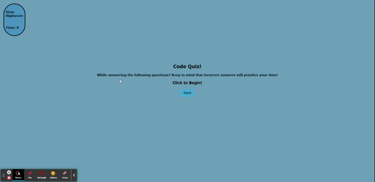

# Code Quiz

## The Task

At some point in our journey to become a full-stack web developer, we will be asked to complete a coding assessment amd perhaps as part of an interview process. A typical coding assessment includes both multiple-choice questions and interactive coding challenges. 

To help familiarize us with these tests and allow us to use the skills covered in this unit, this week’s homework invites us to build a timed coding quiz with multiple-choice questions. This app will run in the browser and will feature dynamically updated HTML and CSS powered by JavaScript code that we write. It will have a clean, polished, and responsive user interface. 

This week’s coursework will equip us with all the skills you need to succeed in this assignment.

## User Story

```
AS A coding boot camp student
WE WANT to take a timed quiz on JavaScript fundamentals that stores high scores
SO THAT we can gauge our progress compared to our past selves. 
```

## Completed Criteria

```
WHEN I am taking a code quiz
THEN I click the start button
WHEN a timer starts and I am presented with a question
THEN I answer a question
WHEN I am presented with another question
THEN I answer a question incorrectly
WHEN time is subtracted from the clock
THEN all questions are answered or the timer reaches 0
WHEN the game is over
THEN I can save my initials and my score
IF you want to check your high-score
THEN you click on high-score button
```

## Mock-Up

The following animation demonstrates the application functionality:



# Git Hub:

*My project was pushed to GitHub at the following repository:https://github.com/syke2good/Code-quiz

*You can access the deployed application with the GitHup Pages link:https://syke2good.github.io/Code-quiz/

# Sources:

- HTML and CSS

- JavaScript

-Screen-Castify

- Semantic HTML

- Web accessibility standards

- Markdown and Visual Studio Code

- Make a README

- Interactive tutorial

# License Copyright (c) 2012-2021 Scott Chacon and others

Permission is hereby granted, free of charge, to any person obtaining a copy of this software and associated documentation files (the "Software"), to deal in the Software without restriction, including without limitation the rights to use, copy, modify, merge, publish, distribute, sublicense, and/or sell copies of the Software, and to permit persons to whom the Software is furnished to do so, subject to the following conditions:

The above copyright notice and this permission notice shall be included in all copies or substantial portions of the Software.

THE SOFTWARE IS PROVIDED "AS IS", WITHOUT WARRANTY OF ANY KIND, EXPRESS OR IMPLIED, INCLUDING BUT NOT LIMITED TO THE WARRANTIES OF MERCHANTABILITY, FITNESS FOR A PARTICULAR PURPOSE AND NONINFRINGEMENT. IN NO EVENT SHALL THE AUTHORS OR COPYRIGHT HOLDERS BE LIABLE FOR ANY CLAIM, DAMAGES OR OTHER LIABILITY, WHETHER IN AN ACTION OF CONTRACT, TORT OR OTHERWISE, ARISING FROM, OUT OF OR IN CONNECTION WITH THE SOFTWARE OR THE USE OR OTHER DEALINGS IN THE SOFTWARE.

